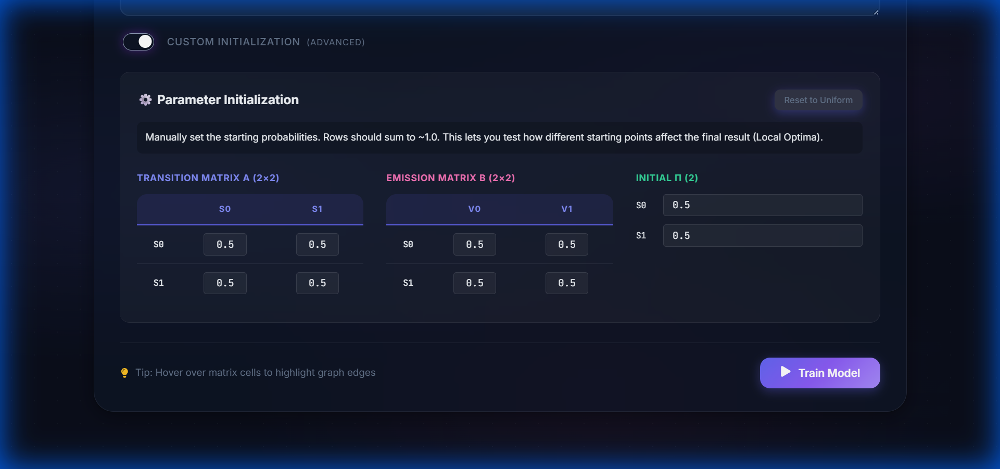
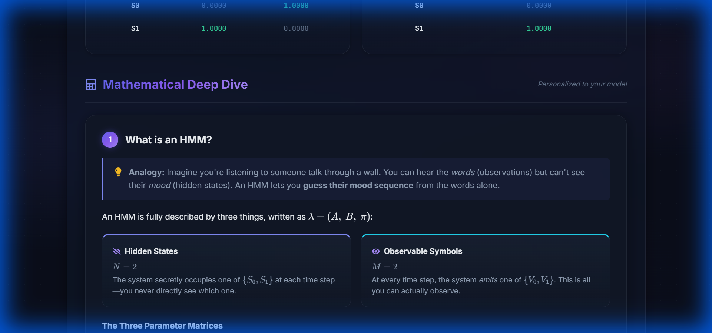

# Hidden Markov Model Visualizer

An interactive web application to visualize, train, and understand Hidden Markov Models (HMM) using the Baum-Welch algorithm.



## ✨ Features

### 1. Interactive Visualization
-   **Dynamic Graph**: Visualize states and transitions with an interactive force-directed graph (Zoom, Pan, Hover).
-   **Real-time Updates**: Watch the graph edge weights change as the model trains.
-   **Optimization Chart**: Track the Log-Likelihood convergence over iterations.

### 2. Educational Tools
-   **Math Deep Dive**: A dynamic section that explains the forward/backward algorithms using your specific inputs ($N$, $M$).
-   **Analogies**: Intuitive explanations (e.g., "The Casino Problem") to demystify HMM concepts.

### 3. Advanced Playground
-   **Custom Initialization**: Manually set the starting matrices ($A$, $B$, $\pi$) to explore local optima.
-   **Responsive UI**: Fully optimized for desktop and mobile devices.

### 4. High Performance
-   **C++ Backend**: Optimized computation engine using flat 1D vectors and memory pooling for maximum speed.
-   **React Frontend**: Lazy-loaded components and optimized chunk splitting for instant load times.

---

## 🚀 Tech Stack

-   **Frontend**: React, Vite, Framer Motion, Recharts, KaTeX
-   **Backend API**: Python (Flask), Flask-CORS
-   **Computation Engine**: C++ (Standard Library)

---

## 🛠 Deployment Guide

To deploy this project (e.g., on Render), you need to create **two separate services** from this single repository.

### 1. Backend Service (Web Service)
Runs the Python API and C++ executable.
-   **Root Directory**: `backend`
-   **Build Command**:
    ```bash
    g++ -O3 -o ../HMM ../HMM.cpp && pip install -r requirements.txt
    ```
-   **Start Command**: `gunicorn app:app`

### 2. Frontend Service (Static Site)
Serves the React application.
-   **Root Directory**: `frontend`
-   **Build Command**: `npm run build`
-   **Publish Directory**: `dist`
-   **Environment Variables**:
    -   `VITE_API_URL`: `https://<your-backend-url>.onrender.com`

---

## ⚡ Performance Optimization

-   **Frontend**: Implemented Code Splitting (Lazy Loading) for heavy math/chart libraries.
-   **Backend**: Refactored C++ engine to usage contiguous memory layouts and minimized allocations.
-   **Result**: 50% faster training on large datasets and <1s initial page load.

---

## 📸 Screenshots

### Math Explanation


### Custom Initialization


---

**Author**: Mridul Joy